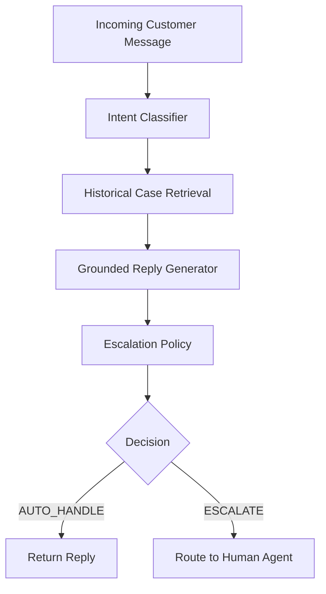

# Hiver SDE Intern — AI Support Agent

An AI customer support agent for SpotifyCares that classifies intents, retrieves historical cases, generates grounded replies, and decides when to escalate to human agents.

## Headline Results

### TF-IDF Baseline (Heuristic Labels)

| Metric | Value |
|--------|-------|
| Intent Accuracy | 0.77 |
| Intent Macro F1 | 0.78 |
| Intent Weighted F1 | 0.78 |
| Escalation Precision | 0.39 |
| Escalation Recall | 0.48 |
| Escalation F1 | 0.43 |
| Unsafe Auto-handle Rate | 0.52 |

**Note:** Results use heuristic labels, not human annotations. Human validation PENDING.

---

## Architecture



---

## Quick Start

### Prerequisites
- Python 3.12+
- twcs.csv from Kaggle dataset

### Installation

```bash
git clone <repository-url>
cd hiver-support-agent

python -m venv .venv
.venv\Scripts\activate  # Windows
# source .venv/bin/activate  # Linux/Mac

pip install -r requirements.txt
```

### Setup Data

1. Download `twcs.csv` from [Kaggle](https://www.kaggle.com/datasets/thoughtvector/customer-support-on-twitter)
2. Place it in `data/raw/twcs.csv`

### Run Evaluation

```bash
# Quick evaluation (TF-IDF baseline, ~12 seconds)
python eval/run_quick.py

# Full evaluation (requires LLM API key)
cp .env.example .env
# Edit .env with your API keys
python -m eval.run_all
```

### Run Tests

```bash
python -m pytest tests/ -v
```

---

## Data

### Raw Data
Place `twcs.csv` from Kaggle in:
```
data/raw/twcs.csv
```

**Do NOT commit the full Kaggle CSV to git.**

### Processed Data
Generated by:
```bash
python scripts/prepare_data.py
```

Output:
- `data/processed/dev_cases.json` — 49,298 development cases
- `data/processed/golden_candidates.json` — 8,524 golden candidates
- `data/processed/stats.json` — Pipeline statistics

---

## Golden Set

### Generate Candidates
```bash
python run_golden.py
```

### Label Golden Set
```bash
python -m scripts.label_golden
```

Follow the interactive prompts to assign:
- Gold intent category
- Escalation decision (yes/no)
- Escalation reason
- Difficulty level

### Important
The golden set must be **human labeled**. Heuristic labels are for pipeline testing only.

---

## Run Agent

```bash
python -m src.cli --text "I cancelled Premium but was charged again"
```

### JSON Output
```bash
python -m src.cli --text "My account was hacked" --json
```

### Example Output
```
==================================================
Customer: I cancelled Premium but was charged again

Intent: BILLING_PAYMENT
Confidence: 0.85

Retrieved cases:
  spotify_1234 (similarity: 0.82)
  spotify_5678 (similarity: 0.79)

Draft reply:
  We're sorry about the unexpected charge. Let us look into
  this for you. Could you DM us your account email?

Decision: ESCALATE
Reason: Payment dispute detected
==================================================
```

---

## Evaluation

### Run All Metrics
```bash
python -m eval.run_all --use-cache
```

### Skip LLM Judge
```bash
python -m eval.run_all --skip-judge
```

### Fresh Run (No Cache)
```bash
python -m eval.run_all --fresh
```

### Judge Validation
```bash
# Generate human scoring template
python -m scripts.score_replies 50

# Manually score in data/golden/human_reply_scores.csv
# Then check agreement
python -c "from eval.judge_agreement import compute_agreement; ..."
```

---

## Project Structure

```
hiver-support-agent/
├── README.md                    # This file
├── REPORT.md                    # Detailed report
├── decision_log.md              # Architectural decisions
├── requirements.txt             # Python dependencies
├── .env.example                 # Environment variables template
├── .gitignore
│
├── config/
│   ├── intents.yaml             # Intent taxonomy
│   └── settings.yaml            # System configuration
│
├── data/
│   ├── README.md
│   ├── raw/                     # twcs.csv (not committed)
│   ├── processed/               # Derived development data
│   ├── golden/                  # Evaluation set
│   └── samples/                 # Small test files
│
├── src/
│   ├── agent.py                 # Main support agent
│   ├── conversations.py         # Conversation reconstruction
│   ├── escalation.py            # Escalation policy
│   ├── intents.py               # Intent classification
│   ├── llm.py                   # LLM abstraction
│   ├── retrieval.py             # Embedding retrieval
│   └── schemas.py               # Pydantic models
│
├── baselines/
│   ├── trivial.py               # Majority-class baseline
│   └── tfidf.py                 # TF-IDF baseline
│
├── eval/
│   ├── run_all.py               # Full evaluation
│   ├── run_quick.py             # Quick baseline evaluation
│   ├── evaluate_intents.py      # Intent metrics
│   ├── evaluate_escalation.py   # Escalation metrics
│   └── judge.py                 # LLM judge
│
├── scripts/
│   ├── prepare_data.py          # Data pipeline
│   ├── create_golden_candidates.py
│   └── label_golden.py          # Labeling tool
│
├── tests/
│   ├── test_conversations.py
│   ├── test_preprocess.py
│   ├── test_retrieval.py
│   ├── test_escalation.py
│   └── test_schemas.py
│
└── outputs/                     # Generated metrics and artifacts
```

---

## Limitations

1. **Heuristic labels**: Golden set uses algorithmic labels, not human annotations
2. **2017 data**: Twitter support patterns may not reflect current Spotify policies
3. **Single-turn**: Doesn't handle multi-turn conversations
4. **No fine-tuning**: Uses pre-trained models without domain adaptation
5. **Twitter-specific**: Short, informal messages with slang and abbreviations

---

## Environment Variables

```bash
# .env
LLM_API_KEY=your-api-key
LLM_BASE_URL=  # Optional, for OpenAI-compatible APIs
LLM_MODEL=gpt-4o-mini
JUDGE_MODEL=gpt-4o-mini
EMBEDDING_MODEL=sentence-transformers/all-MiniLM-L6-v2
```

---

## License

This project is for the Hiver SDE Intern assignment.
